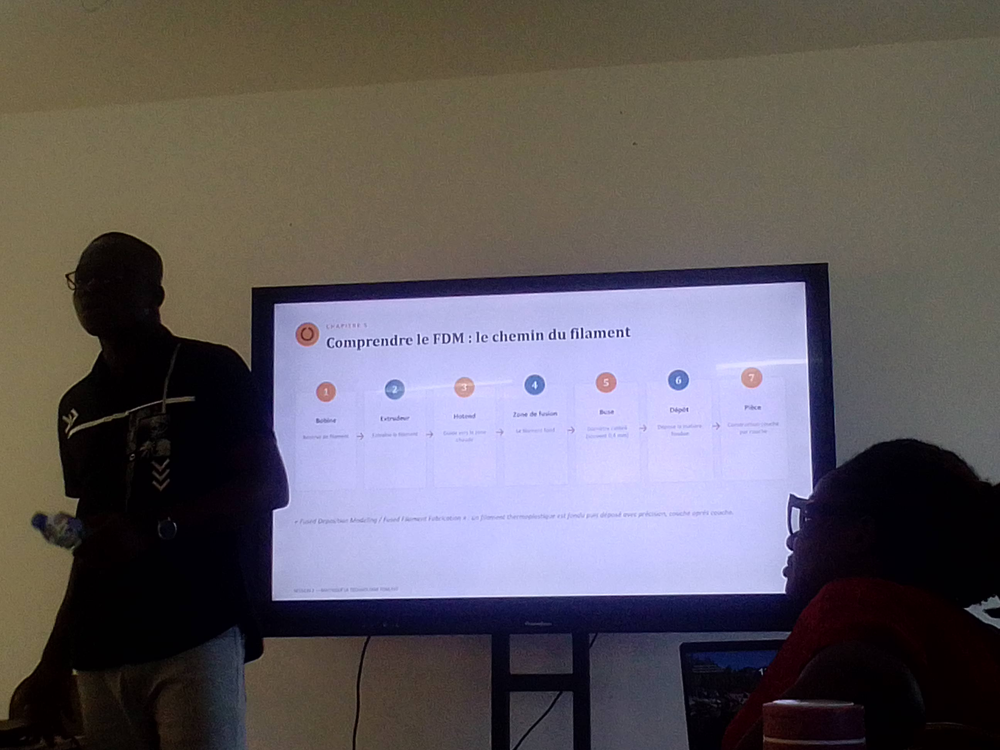
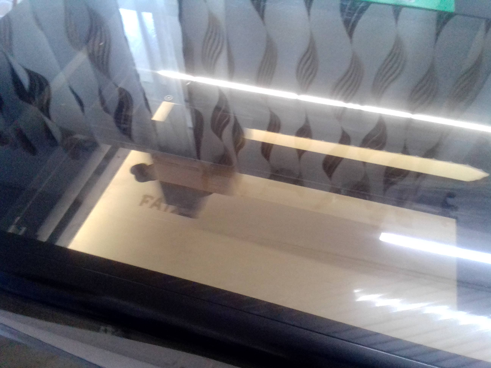
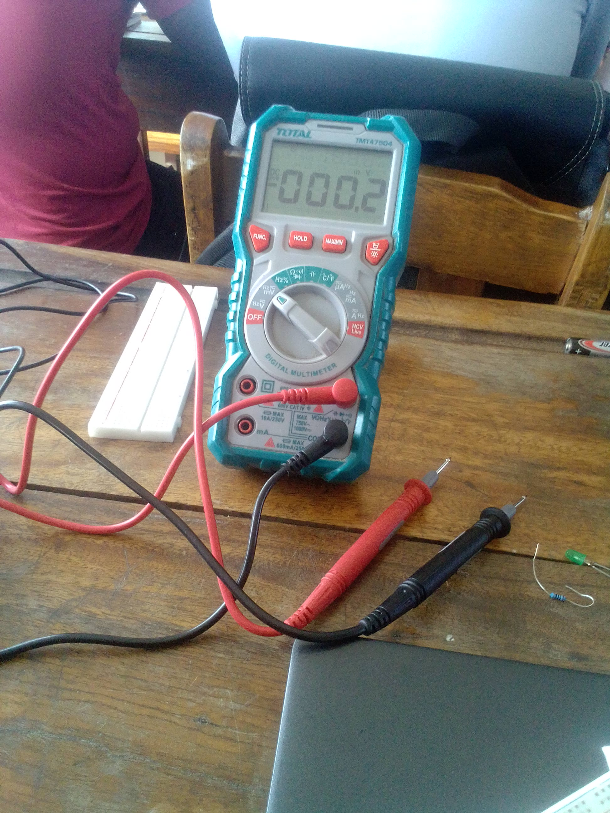
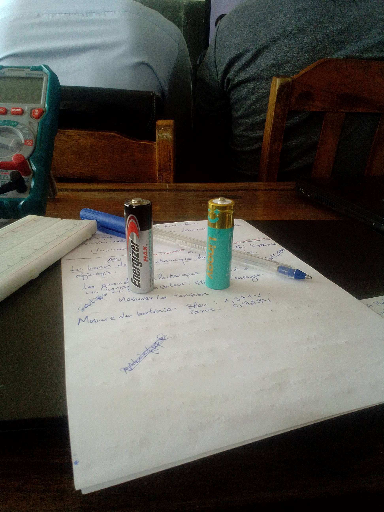

# Journal — mardi 26 août 2026 par Mohamed Faïz Mounirou BOURAÏMA

## Fait aujourd'hui

- Mise en information des matériaux à utiliser et le déroulement des projets présenté par M. OLANLO
- Atelier de fabricaton soustractive(*initiation au découpe laser*) présenté par M. SITOU Lawson
- Atelier d'électronique (*initiation sur la base de l'électronique*) présenté par M. Koffi et M. Wisdom
- Atelier de fabrication additive(*initiation à l'impression 3D)
   

## Appris

- Les outils primordiaux pour notre projet : Le microcontroleur CIAO ESP3 S3 et le micropython
- Les fondamentaux de la technologie; la marque xtool et étude de 4 machine phare de la découpe laser (CO2; fibre; diode et F2)
- Les composantes de l'électroniques; les instruments de mesures et leur utilisation effective.
- le fonctionnement d'un imprimente 3D: le chemin du filament; l'anatomie de l'imprimente et les formats de fichiers

## Raté, puis corrigé

- Impression personnel avec l'impression 3D → Manque de compréhension sur le processus → aide du formateur → une deuxième suivie de meilleur qualité.

## À faire demain

- Même routine avec les 4 ateliers
