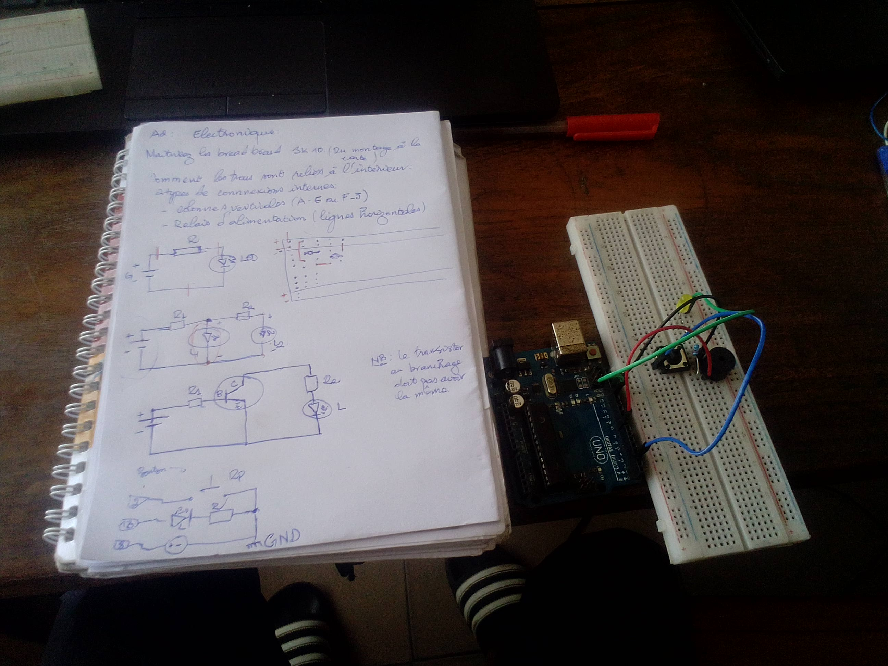
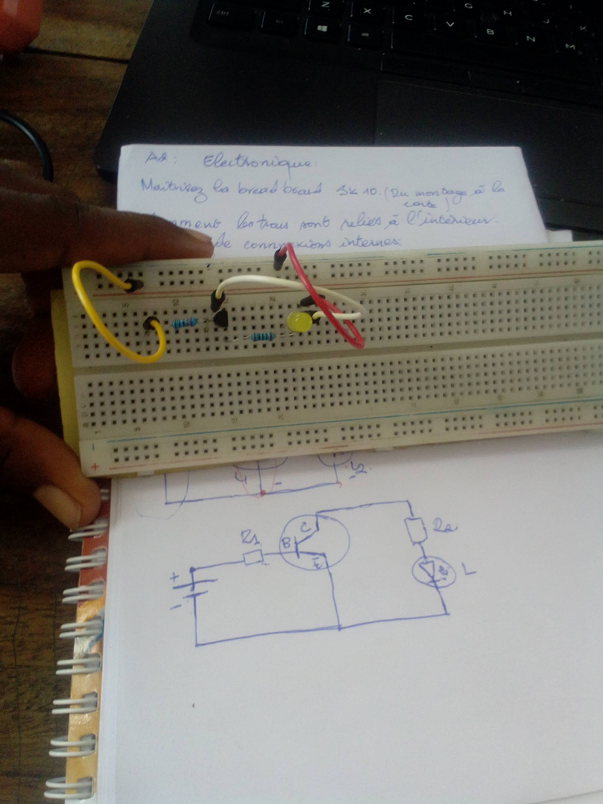

# Journal — Lundi 01 septembre 2026 rédigé par : Mohamed Faïz Mounirou BOURAÏMA
## Fait aujourd'hui
- Introduction à l'impression avec DTF
- Maitrise de bread Board SK10
- Introduction à la conception en 3D avec fusion 360

## Appris
- la définition de DTF et les étape de l'impression avec la DTF.
- L'utilisation du breadbord et les montages électrique
 
- utilisation des fonctionnalité de base de fusion 360 et cas pratique.
  

## À faire demain

- Non communiqué
