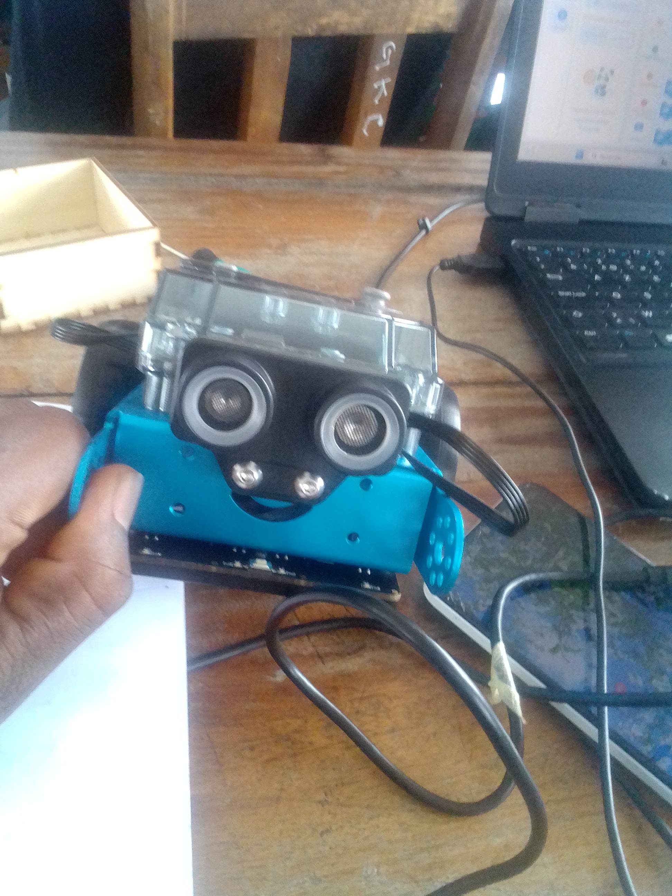
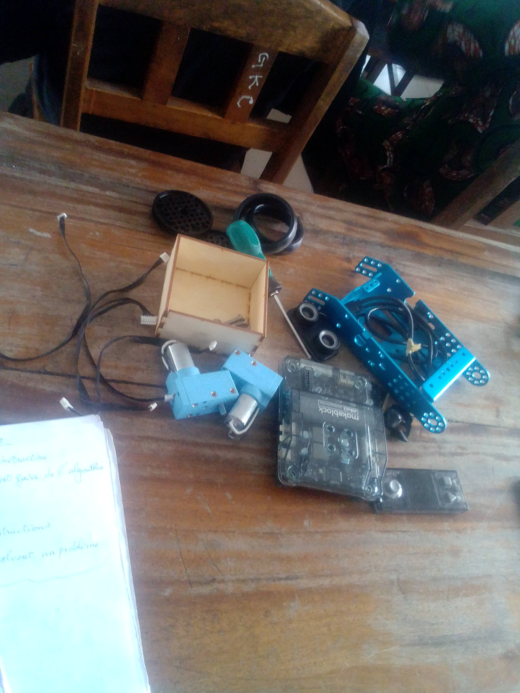

# Journal — Mercredi 2 septembre 2026 rédigé par : Mohamed Faïz Mounirou BOURAÏMA
## Fait aujourd'hui

- Introduction à l'algorithmique
- Atelier d'électronique : **programmation d'automobile autonome avec Raspery Pi**.
 
- Revue des projets

## Appris

- la définition de l'algorimthme et de l'algorithmique débranché
- Monter les composants du kit raspery Py
- Bien choisir ses composants pour ses projets.

## À faire demain

- Non communiqué
