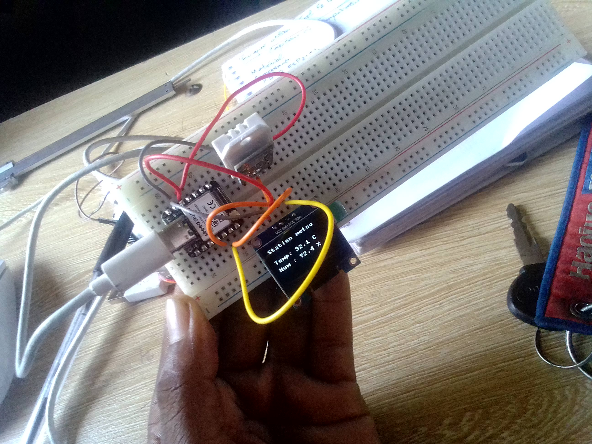

# Journal — Samedi 5 septembre 2026 rédigé par : Mohamed Faïz Mounirou BOURAÏMA
## Fait aujourd'hui

- Conception de smart weather

## Appris

- Matériel nécessaire de la conception et le schéma de cablage
- La configuration et l'installation des bibliothèques pour le démarage du bibliothèque

## À faire demain

- Non communiqué
