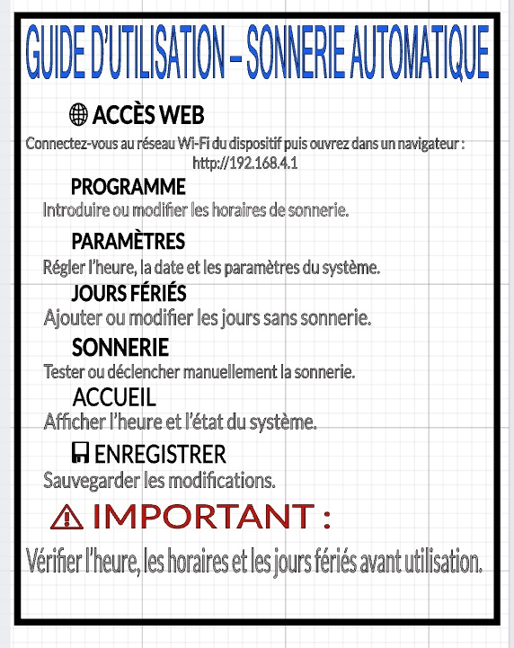

# Journal — jeudi 17 septembre 2026 (rédigé par : Mohamed Faïz Mounirou BOURAÏMA)

## Fait aujourd'hui

### 1. Correction et impression du boîtier — suite et fin

* Poursuite de la finalisation du **boîtier du projet P083 — SOLARBELL, sonnerie automatique autonome à énergie solaire**.
* Le travail a commencé par un **essai d’intégration des batteries dans le boîtier** afin de vérifier concrètement leur encombrement et leur positionnement par rapport à l’espace disponible.
* Cette étape d’essai a permis de vérifier que les différents éléments pouvaient être correctement disposés à l’intérieur du boîtier sans compromettre leur intégration avec les autres sous-ensembles électroniques.
* À partir de cet essai, nous avons procédé à des **ajustements de l’organisation interne du boîtier**, notamment au niveau de l’emplacement réservé au système de stockage d’énergie et aux autres éléments du montage.
* L’objectif était d’obtenir une organisation interne plus cohérente et de faciliter l’assemblage final du prototype.
* Après les ajustements, le modèle du boîtier a été préparé pour passer à la fabrication physique.
* Le **boîtier définitif a ensuite été imprimé en 3D**.

* Une attention particulière a également été portée au **couvercle du boîtier**, qui constitue l’élément permettant de fermer et de protéger l’ensemble du montage électronique.
* Le couvercle a été réalisé et imprimé en tenant compte des dimensions du boîtier afin de permettre son intégration avec celui-ci.

* Cette étape marque la finalisation de la partie mécanique principale du prototype avant l’intégration complète des éléments électroniques.

### 2. Conception et réalisation du guide d’utilisation avec xTool

* Dans le cadre de la finalisation du prototype, nous avons également travaillé sur la réalisation d’un **guide d’utilisation destiné à accompagner la sonnerie automatique**.
* La première étape a consisté à concevoir le contenu graphique du guide à l’aide du **logiciel xTool**.
* Les informations ont été organisées de manière à permettre à l’utilisateur de comprendre plus facilement le fonctionnement et l’utilisation du dispositif.
* Le travail dans xTool a donc consisté à préparer le fichier graphique qui servira de support pour la réalisation physique du guide.

* Une fois le modèle préparé, nous avons procédé à son **impression à l’aide de la machine DTF**.
* Le processus a permis d’obtenir le support imprimé correspondant au guide conçu précédemment dans xTool.
* Après l’impression, le support a été vérifié avant son utilisation pour l’étape suivante.

* Le guide imprimé a ensuite été **reporté sur une plaque de contreplaqué**.
* Cette opération permet d’obtenir un support physique plus adapté à l’intégration au prototype et destiné à servir de **support d’information et d’utilisation** pour la sonnerie automatique.
* Le report du guide constitue ainsi une étape de transformation du contenu numérique conçu dans xTool en un élément physique intégré au projet.

### 3. Assemblage de l’ensemble du montage

* Après la réalisation du boîtier et du guide d’utilisation, nous avons poursuivi l’**assemblage global du prototype SOLARBELL**.
* Cette étape consiste à réunir progressivement les différents sous-ensembles réalisés au cours des journées précédentes.
* Les principaux éléments concernés sont notamment :

  * la **carte électronique fabriquée et assemblée** ;
  * le **système de stockage d’énergie** ;
  * les éléments de commande et d’affichage ;
  * les différents éléments nécessaires au fonctionnement de la sonnerie ;
  * le **boîtier imprimé en 3D**.
  
* L’intégration est réalisée en tenant compte de l’espace disponible dans le boîtier et de l’organisation définie lors de la conception mécanique.
* Une vérification de la disposition générale des éléments a été effectuée afin de préparer le prototype aux essais et à la présentation.
* Cette phase constitue une étape importante puisqu’elle permet de passer progressivement d’éléments fabriqués séparément à un **prototype fonctionnel intégré**.

### 4. Réalisation du PowerPoint pour la présentation du projet

* Une partie de la journée a également été consacrée à la préparation du **PowerPoint de présentation du projet P083 — SOLARBELL**.
* Le travail a consisté à organiser les informations nécessaires à la présentation du projet devant le public.
* La présentation a été structurée autour des principaux éléments du projet :

  * le **problème identifié** ;
  * le contexte et le besoin ;
  * la **solution SOLARBELL** proposée ;
  * le principe d’autonomie énergétique ;
  * la réalisation du prototype ;
  * la pertinence de la solution ;
  * l’impact attendu ;
  * la présentation de l’équipe.
* Les différents éléments graphiques et textuels ont été intégrés afin de rendre la présentation plus claire et plus professionnelle.
* Cette préparation permettra de présenter non seulement le prototype final, mais également la **démarche de conception, de fabrication et d’intégration** suivie par le groupe.

## Appris

* J’ai appris que la conception d’un boîtier destiné à recevoir un système électronique nécessite de prendre en compte **l’encombrement réel des composants** et pas uniquement leurs dimensions théoriques.
* J’ai compris l’importance de réaliser un **essai d’intégration physique avant l’impression définitive** du boîtier. Cette méthode permet de vérifier la compatibilité entre la conception numérique et les composants réels.
* J’ai approfondi le processus de fabrication additive à travers la préparation et l’**impression 3D du boîtier et de son couvercle**.
* J’ai également appris à utiliser **xTool** pour concevoir un support graphique destiné à accompagner un produit ou un prototype.
* J’ai compris le passage d’un fichier numérique à un support physique en utilisant successivement la **conception graphique, l’impression DTF et le report sur contreplaqué**.
* J’ai compris qu’un prototype doit être pensé comme un **système intégré**, et non comme une simple juxtaposition de composants électroniques.
* J’ai également appris que la présentation finale doit refléter les différentes étapes de développement du projet : **identification du problème, conception, fabrication, assemblage, essais et résultat obtenu**.

## Raté, puis corrigé

* Les travaux de la journée ont principalement porté sur la **finalisation et l’intégration du prototype**.
* Avant l’impression définitive du boîtier, un **essai d’assemblage des batteries** a été réalisé afin de vérifier leur positionnement et leur compatibilité avec l’espace interne disponible.
* Cet essai a servi de base aux ajustements réalisés sur l’organisation interne du boîtier avant sa fabrication définitive.
* Les modifications apportées ont permis de poursuivre la réalisation du boîtier et son intégration avec les différents éléments du montage.

## Décidé

* Finaliser définitivement l’intégration des différents éléments dans le **boîtier imprimé en 3D**.
* Utiliser le guide réalisé avec **xTool et imprimé par DTF** comme support d’information associé au prototype.
* Poursuivre l’assemblage du système jusqu’à l’obtention d’un prototype complet et correctement organisé.
* Effectuer les vérifications nécessaires sur l’ensemble du montage avant la présentation.
* Finaliser le **PowerPoint SOLARBELL** en mettant en évidence la démarche suivie par le groupe, depuis l’identification du problème jusqu’à la réalisation du prototype.
* Préparer l’ensemble du matériel nécessaire pour la **présentation de vendredi**.

## À faire demain

* Finaliser l’**assemblage mécanique et électronique** du prototype SOLARBELL.
* Vérifier le positionnement des différents éléments à l’intérieur du boîtier.
* Effectuer les **tests de fonctionnement du système complet** avant la présentation.
* Vérifier l’alimentation et le fonctionnement des différents sous-ensembles intégrés.
* Contrôler le fonctionnement de la carte électronique et des éléments associés.
* Finaliser la présentation PowerPoint et effectuer une **répétition de la présentation orale**.
* Préparer le prototype, le guide d’utilisation et les autres supports nécessaires pour la **présentation finale du projet P083**.